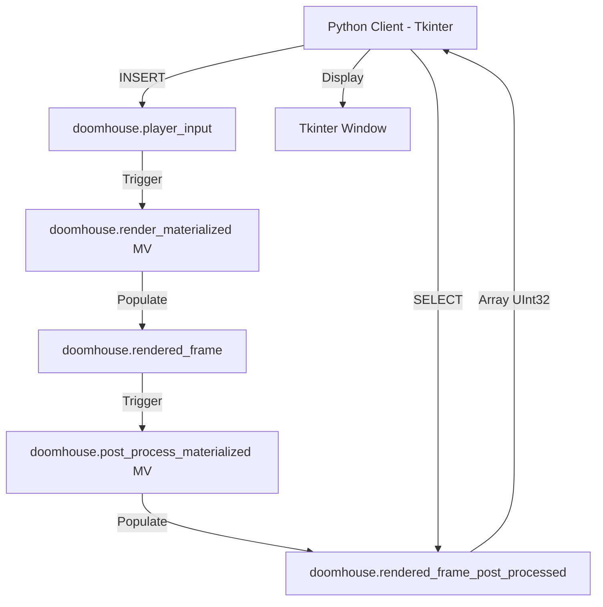
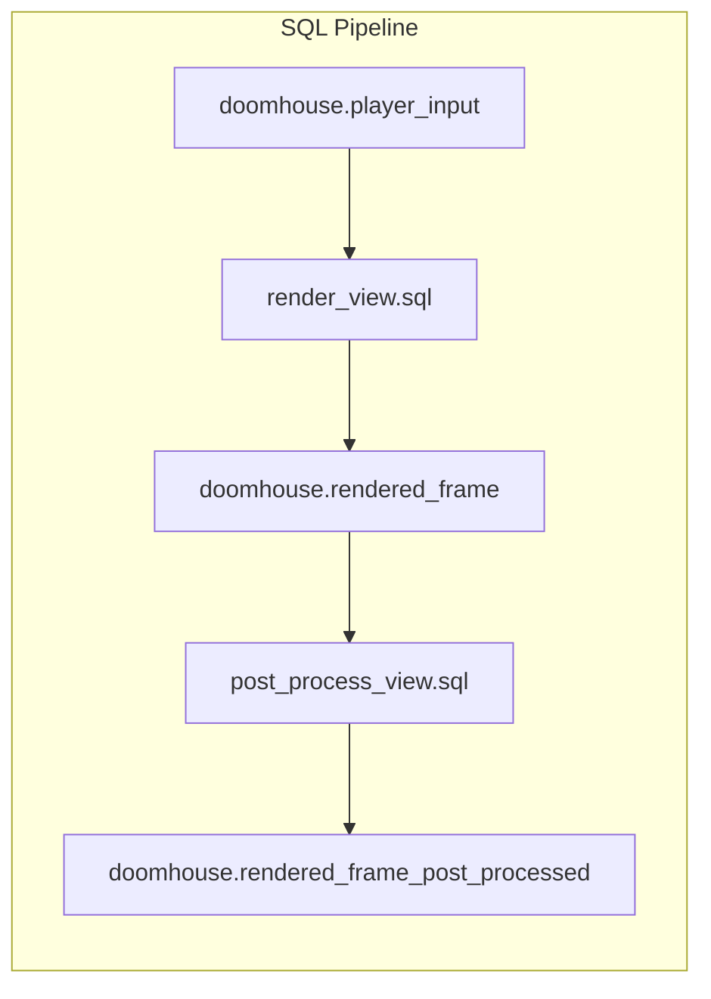
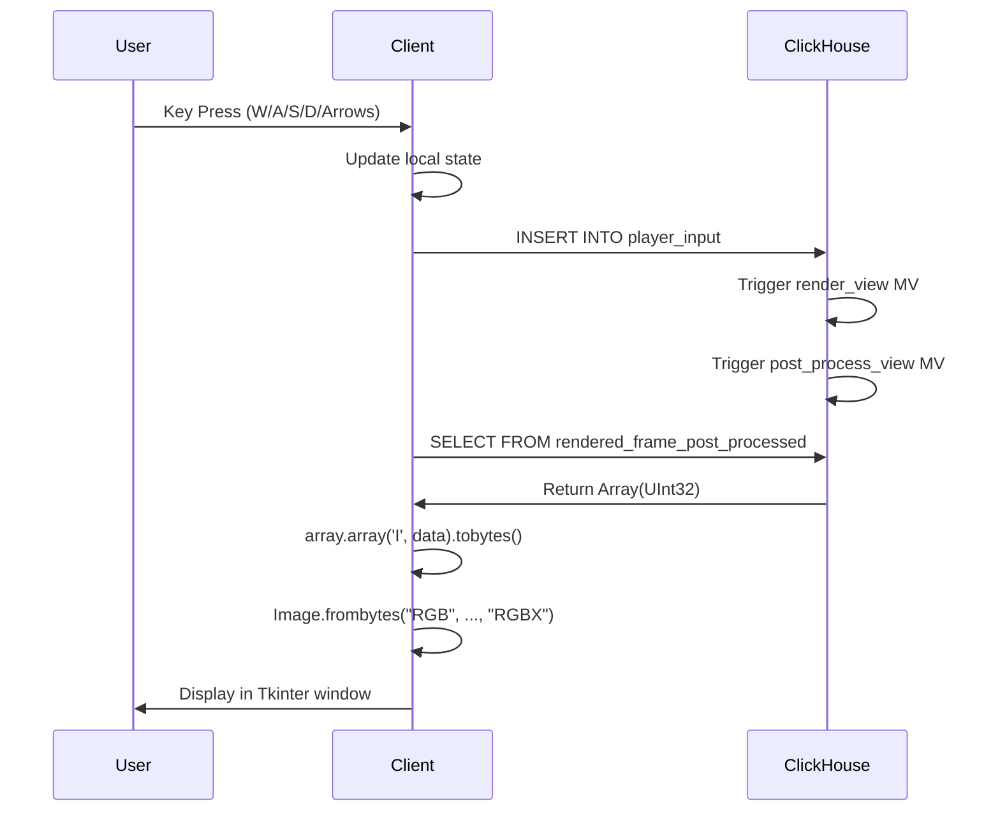

# DOOMHouse Architecture

## System Overview

DOOMHouse follows a unique client-server architecture where the database acts as the rendering engine, using a multi-stage Materialized View pipeline for asynchronous rendering and post-processing.



## Source Code Structure

```
DoomHouse/
├── src/
│   ├── DOOMHouse.py          # Main Python client application
│   └── SQL/
│       ├── player_input_table.sql   # Input table definition
│       ├── rendered_frame_table.sql # Raw frame buffer table
│       ├── rendered_frame_post_processed_table.sql # Final frame buffer
│       ├── render_view.sql          # Core Raycasting MV
│       ├── post_process_view.sql    # SWAR-based Blur/Smoothing MV
│       ├── create_dictionaries.sql  # Map and Texture dictionaries
│       └── create_source_tables.sql # Source data for dictionaries
├── textures/                  # External texture directory
├── .kilocode/
│   └── rules/
│       └── memory-bank/      # Project documentation
└── Notes.md                  # Development history
```

## Component Architecture

### Python Client - [`DOOMHouse`](src/DOOMHouse.py:53) Class

The single [`DOOMHouse`](src/DOOMHouse.py:53) class encapsulates all client logic:

| Method | Purpose |
|--------|---------|
| [`__init__()`](src/DOOMHouse.py:54) | Initialize Tkinter window, connect to DB, setup frame tracking |
| [`run()`](src/DOOMHouse.py:457) | Main loop handling input and splash screen |
| [`process_input()`](src/DOOMHouse.py:412) | Handle keyboard state and calculate target movement |
| [`push_input()`](src/DOOMHouse.py:437) | Insert player state into ClickHouse |
| [`render()`](src/DOOMHouse.py:473) | Pull `Array(UInt32)` from DB, convert to bytes, display via PIL/Tkinter |
| [`switch_theme()`](src/DOOMHouse.py:278) | Cycle through texture themes (Classic, Dungeon) |

### SQL Rendering Engine

The rendering logic is split into two stages:



#### Key SQL Components

1. **Map & Texture Dictionaries** ([`create_dictionaries.sql`](src/SQL/create_dictionaries.sql:1))
   - Map data and textures are stored in ClickHouse Dictionaries for O(1) lookup.
   - Textures are split into separate R, G, B channels to avoid bit-unpacking overhead.

2. **Collision Logic** ([`render_view.sql`](src/SQL/render_view.sql:273))
   - "Slide-and-collide" logic: checks X and Y axes independently.
   - Uses a 0.2 unit buffer to prevent sticking to walls.

3. **Vectorized Raycasting** ([`render_view.sql`](src/SQL/render_view.sql:244))
   - Replaces loops with `arrayMap` and `range(1, RAY_STEPS)`.
   - Finds first wall intersection using `arrayMin`.

4. **Post-Processing (SWAR)** ([`post_process_view.sql`](src/SQL/post_process_view.sql:1))
   - Implements a box blur/smoothing filter.
   - Uses SIMD Within A Register (SWAR) to process R and B channels in parallel within a single UInt32.

5. **Lighting & Fog** ([`render_view.sql`](src/SQL/render_view.sql:203))
   - Distance-based fog (fades to black at 20 units).
   - Fake contrast (N/S walls are 40% darker).

## Data Flow

### Render Cycle



### Texture Data Flow

1. Textures are loaded by Python at startup and inserted into `tex_source` tables.
2. ClickHouse Dictionaries (`dict_tex_wall1_data`, etc.) load from these tables.
3. The rendering engine performs `dictGet` for every pixel.

## Key Design Patterns

### Pattern: Database as Compute Engine
The entire rendering algorithm runs in SQL, treating ClickHouse like a GPU. This is unconventional but demonstrates SQL's Turing completeness.

### Pattern: Stateless Server
ClickHouse holds no game state. All state lives in the Python client. Each query is self-contained with all necessary data embedded.

### Pattern: Packed Binary Framebuffer
The query outputs an `Array(UInt32)` representing the framebuffer. This is significantly faster than the previous text-based PPM format.

### Pattern: Deterministic Randomness
Uses `cityHash64()` with wall block coordinates as seed. Same wall block always gets same "random" flip, ensuring visual consistency across frames.

## Critical Implementation Details

### Player Vector System
- **Position**: `(pos_x, pos_y)` - floating point world coordinates
- **Direction**: `(dir_x, dir_y)` - normalized direction vector
- **Camera Plane**: `(plane_x, plane_y)` - perpendicular to direction, defines FOV

### Resolution
- Internal render: 640x320 (W=320*2, H=240*2)
- Display: 640x480 (upscaled with NEAREST)
- Texture: 64x64 pixels

### Map Coordinate System
- Map indices are 1-based in SQL (due to `ceil()` usage)
- World coordinates are 0-based floats
- Collision margin: 0.2 units from wall center

---

## SQL Raycasting Algorithm Deep Dive

The raycasting implementation in SQL is the core innovation of DOOMHouse. This section explains how the algorithm works within the constraints of ClickHouse SQL.

### Overview

Traditional raycasting uses a DDA (Digital Differential Analysis) algorithm with while-loops to step through the map grid. Since ClickHouse lacks true while-loops or recursive CTEs, DOOMHouse uses a clever distance-sorting approach instead.

### Step 1: Ray Direction Calculation

For each screen column `x` from 0 to W-1:

```sql
2.0 * number / W - 1.0 AS camera_x,           -- Maps column to [-1, 1]
dir_x + plane_x * camera_x AS ray_dir_x,      -- Ray X component
dir_y + plane_y * camera_x AS ray_dir_y       -- Ray Y component
```

The `camera_x` value converts pixel column to camera-space coordinate. The player's direction vector `(dir_x, dir_y)` plus camera plane `(plane_x, plane_y)` creates a 66° FOV typical of classic Doom-like games.

### Step 2: Distance Candidate Generation

Instead of stepping through the grid, DOOMHouse pre-computes all possible intersection distances:

```sql
arraySort(arrayConcat(
    -- X-axis grid line intersections (vertical walls)
    arrayMap(i -> (floor(valid_x) + (ray_dir_x > 0 ? i : -i + 1) - valid_x) / ray_dir_x,
             range(1, 14)),
    -- Y-axis grid line intersections (horizontal walls)
    arrayMap(i -> (floor(valid_y) + (ray_dir_y > 0 ? i : -i + 1) - valid_y) / ray_dir_y,
             range(1, 14))
)) AS dists
```

This generates up to 26 candidate distances (13 for each axis) sorted from nearest to farthest. The `range(1, 14)` limits view distance to 13 cells.

### Step 3: First Wall Hit Detection

The `arrayFirst()` function finds the first distance where a wall exists:

```sql
arrayFirst(d ->
    d > 0 AND
    toInt32(ceil(valid_y + ray_dir_y * (d + 0.001))) BETWEEN 1 AND 8 AND
    toInt32(ceil(valid_x + ray_dir_x * (d + 0.001))) BETWEEN 1 AND 8 AND
    substring(
        map[toInt32(ceil(valid_y + ray_dir_y * (d + 0.001)))],
        toInt32(ceil(valid_x + ray_dir_x * (d + 0.001))),
        1
    ) IN ('1', '2')
, dists) AS raw_dist
```

Key points:
- `d + 0.001` nudges past the exact intersection to sample inside the cell
- `ceil()` converts world coordinates to 1-based map indices
- `substring()` extracts the character at that map position
- `IN ('1', '2')` checks for wall types (empty is '0')

### Step 4: Wall Height Calculation

Perpendicular distance avoids fisheye distortion:

```sql
raw_hit_dist * (p_dir_x * r_dir_x + p_dir_y * r_dir_y) as perp_wall_dist,
toInt32(H_HALF - (H / (perp_wall_dist + 0.0001)) * 0.5) AS draw_start,
toInt32(H_HALF + (H / (perp_wall_dist + 0.0001)) * 0.5) AS draw_end
```

The wall height is inversely proportional to distance. `0.0001` prevents division by zero.

### Step 5: Side Detection

Determines if a vertical or horizontal wall was hit for shading:

```sql
(dist_y < dist_x) as side
```

If the distance to the Y-axis intersection is smaller, we hit a horizontal wall (side=true).

### Step 6: Texture Coordinate Mapping

```sql
-- Texture mapping: Calculate where exactly on the wall unit the ray hit (0.0 to 1.0)
toInt32((hit_x - floor(hit_x)) * TEX_SIZE) as hit_x_wall_raw,
toInt32((hit_y - floor(hit_y)) * TEX_SIZE) as hit_y_wall_raw,

-- Texture mirroring (visual fix for alignment)
if(bitAnd(intHash32(toInt32(hit_y)), 1) = 0, TEX_MAX - hit_x_wall_raw, hit_x_wall_raw) as hit_x_wall,
if(bitAnd(intHash32(toInt32(hit_x)), 1) = 0, TEX_MAX - hit_y_wall_raw, hit_y_wall_raw) as hit_y_wall
```

### Step 7: Pixel Color Assembly (Packed UInt32)

```sql
-- Channel Split & Pre-calc
bitOr(
    bitOr(
        bitShiftLeft(toUInt32(dictGet('doomhouse.dict_tex_wall1_data', 'r', w_tex_idx) * base_shade), 0),
        bitShiftLeft(toUInt32(dictGet('doomhouse.dict_tex_wall1_data', 'g', w_tex_idx) * base_shade), 8)
    ),
    bitShiftLeft(toUInt32(dictGet('doomhouse.dict_tex_wall1_data', 'b', w_tex_idx) * base_shade), 16)
) AS final_color
```

### Performance Characteristics

| Operation | Complexity |
|-----------|------------|
| Ray generation | O(W) - linear with screen width |
| Distance sorting | O(26 log 26) per ray - constant |
| Pixel rendering | O(W × H) - 307,200 operations |
| Texture lookups | O(W × H) - one per visible wall pixel |

The algorithm trades memory (pre-computed distance arrays) for the ability to run without loops, making it feasible in SQL.
