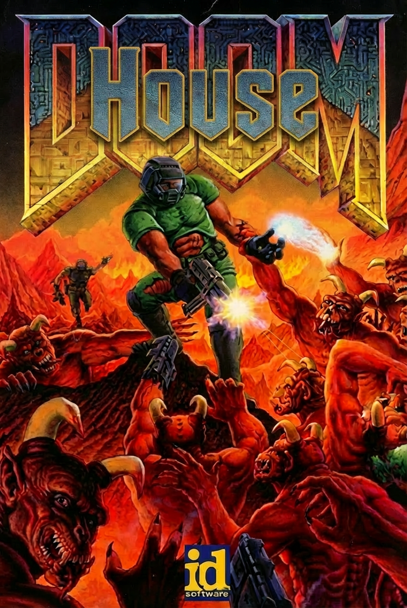
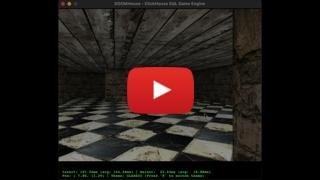
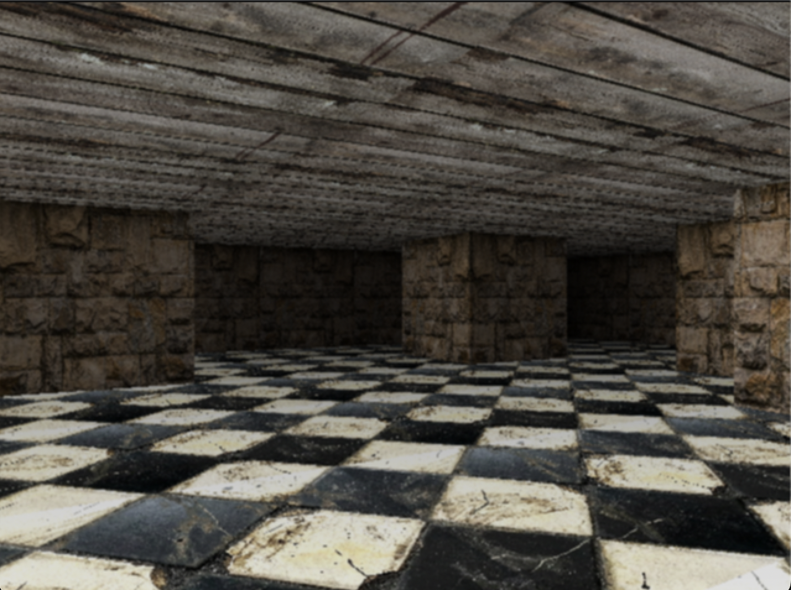

# DOOMHouse

<p align="center">
  
</p>

### DISCLAIMER 
_**This repository is ~95% generated using Kilo Code with Gemini 3.0 Pro Preview, Gemini 3.0 Flash Preview, Opus 4.5 and ChatGPT 5.2.**_ 

### Description

DOOMHouse is an experimental "Doom-like" 3D game rendering engine that offloads all the rendering logic entirely to a ClickHouse database. 

This project serves multiple purposes:
 - As a playground for exeprimenting with agentic coding, using frontier models to solve highly complex and non-trivial tasks.
 - As a proof-of-concept, demonstrating that modern analytical databases like ClickHouse are powerful enough to handle complex, non-traditional computational tasks — specifically real-time 3D graphics generation.
- As a fun way to learn about and experiment with advanced ClickHouse concepts. 

The core graphics logic — including collision detection, raycasting, texture mapping, and shading — is executed via SQL queries, while a lightweight Python client handles user input and displays the resulting frames.

### Screen recording
[](https://www.youtube.com/watch?v=_yni1K0cqW8)

### Themes
The engine supports different visual styles through SQL-based rendering logic. Examples:
| Theme 1 | Theme 2 |
|---------|---------|
|  |  |

## Prerequisites

- **Python 3.11 or later**
- **ClickHouse Server 26.1.1.562 or later** (Local or Remote)

## Installation

**OBS**: Due to an issue with some newer versions of ClickHouse this program only supports ClickHosue version `26.1.1.562` or later. 

### 1. Install ClickHouse Server Locally

If you don't have ClickHouse installed, you can run it easily using Docker or install it directly on your system.

#### Using Docker (might be slower than native installation)
```bash
docker run -d --name clickhouse-server -p 8123:8123 -p 9000:9000 --ulimit nofile=262144:262144 clickhouse/clickhouse-server
```

#### Native Installation (macOS/Linux)
For macOS (using Homebrew):
```bash
brew install clickhouse
brew services start clickhouse
```
For macOS or Linux:
```bash
curl https://clickhouse.com/ | sh
./clickhouse server
```

### 2. Install Python Dependencies

Install the required libraries using `pip`:
```bash
pip install -r requirements.txt
```

The project depends on:
- `clickhouse-connect`: Database connector
- `Pillow`: Image processing and texture loading
- `python-dotenv`: Environment variable management

## Configuration

If you already have a ClickHouse server running or need to change the default connection settings, modify the `.env` file in the project root:

```env
CLICKHOUSE_HOST=localhost
CLICKHOUSE_PORT=8123
CLICKHOUSE_USER=default
CLICKHOUSE_PASS=
```
to the specifc connection settings needed to connect to the server.

## Running the Application

1. Ensure your ClickHouse server is running.
2. Run the main Python script:
   ```bash
   python src/DOOMHouse.py
   ```

## Controls

| Key | Action |
|-----|--------|
| ↑ / W | Move Forward |
| ↓ / S | Move Backward |
| ← / A | Rotate Left |
| → / D | Rotate Right |
| T     | Switch theme |
| Esc | Exit |

## Acknowledgments

This project is amongst other inspired by:
- [DoomQL: Rendering Doom in a Database](https://cedardb.com/blog/doomql/)
- [DuckDB-Doom: Rendering Doom in DuckDB](https://www.hey.earth/posts/duckdb-doom)
- [Announcing adsb.exposed - Interactive Visualization and Analytics on ADS-B Flight Data with ClickHouse](https://clickhouse.com/blog/interactive-visualization-analytics-adsb-flight-data-with-clickhouse)
- [Writing a retro 3D FPS engine from scratch](https://medium.com/@btco_code/writing-a-retro-3d-fps-engine-from-scratch-b2a9723e6b06)
